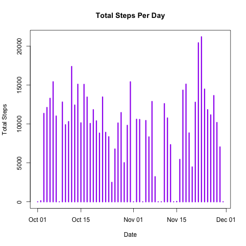
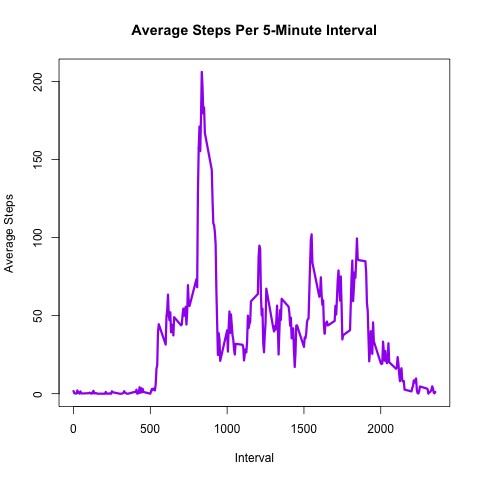
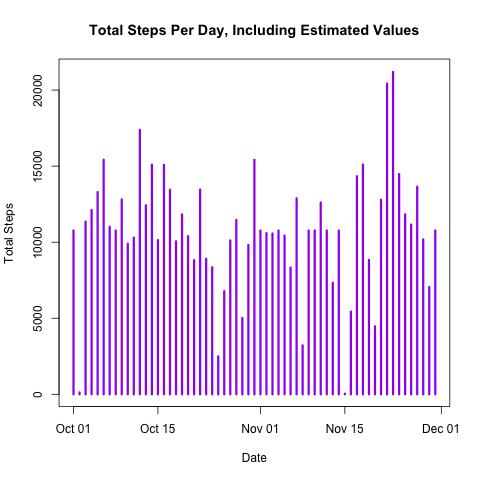
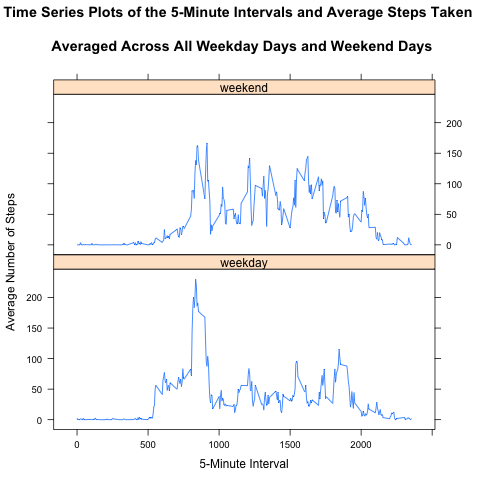

# Reproducible Research: Peer Assessment 1

### Introduction to the Assignment
Devices such as Fitbit, Nike Fuelband, and Jawbone Up can be used to gather data about personal movement activities.  This assignment uses data from a personal activity monitoring device.  The data consists of two months of data collected at 5-minute intervals throughout the day.  The data was collected in October and November, 2012, and includes the number of steps taken by an individual at each interval.

### Variables in the dataset
The dataset is stored in a CSV file, and there are 17,568 observations.  The variables included in this dataset are:
* steps:  The number of steps taken in a 5-minute interval.  Missing values are recorded as NA.
* date:  The date on which the measurement was taken in YYYY-MM-DD format.
* interval:  The identifier for the 5-minute time interval in which the measurement was taken.

### Loading and preprocessing the data
The following R code is needed to load the required libraries, unzip and read in the csv file, and convert the dates from strings to dates:

```r
## Load libraries
require(plyr)
require(ggplot2)
require(lattice)

## Unzip the downloaded zip file and read the csv file
unzip("repdata-data-activity.zip")
activity <- read.csv("activity.csv")

# use as.Date() to convert strings to dates
activity <- transform(activity, date = as.Date(date))
```

### What is mean total number of steps taken per day?

Here is the R code and resulting plot for the number of steps taken each day.  The mean and median are calculated, and reported below.

```r
# Make a histogram of the total number of steps taken each day
totalStepsPerDay <- tapply(activity$steps, activity$date, FUN=sum, na.rm=TRUE)
dates <- unique(activity$date)

# create the png file
png("plotTotalSteps.png")

plot(dates, 
     totalStepsPerDay, 
     main = "Total Steps Per Day", 
     xlab = "Date", 
     ylab = "Total Steps", 
     type = "h",
     lwd = 3,
     col="purple")
dev.off()
         
meanTotalStepsPerDay <- mean(totalStepsPerDay)
medianTotalStepsPerDay <- mean(totalStepsPerDay)
```

 

Results - mean and median of the activity dataset:

> meanTotalStepsPerDay
[1] 9354.23
> medianTotalStepsPerDay
[1] 9354.23
> 

### What is the average daily activity pattern?

Here is the R code and resulting time series plot to show the 5-minute interval (x-axis) and the average number of steps taken, averaged across all days (y-axis).  The 5-minute interval (on average across all the days in the dataset) that contains the maximum number of steps is calculated below.

```r
avgStepsPerInterval <- aggregate(x=list(avgSteps = activity$steps), by=list(interval = activity$interval), FUN=mean, na.rm=T)

# create the png file
png("plotStepsIntervals.png")

plot(avgStepsPerInterval, 
     main = "Average Steps Per 5-Minute Interval", 
     xlab = "Interval", 
     ylab = "Average Steps", 
     type = "l",
     lwd = 3,
     col="purple")
dev.off()

maxStepsPerInterval <- avgStepsPerInterval[which.max(avgStepsPerInterval$avgSteps), ]
```

 

Results - the interval 835 contains the maximum number of steps, which is 206.1698:

> maxStepsPerInterval
    interval avgSteps
104      835 206.1698
> 

### Imputing missing values

Here is the R code for determining the number of missing values, a strategy for filling in the missing values, a new dataset with missing values filled in, a histogram showing the total number of steps taken each day using the new dataset, and mean and median calculations for the total number of steps taken per day using the new dataset.

```r
missingData <- is.na(activity)
numberRowsWithNA <- sum(missingData)
```

Results - total number of missing values in the dataset (i.e. the total number of rows with NAs) :

> numberRowsWithNA
[1] 2304

```r
# Replace the missing values with an estimated value for each row
# that contains a missing steps value by doing the following:

activityAddedValues <- activity
numOfRows <- length(activity$steps)

# Replace NA with the avgStepsPerInterval value for that interval

for (i in 1:numOfRows) {
    thisRow <- activityAddedValues[i, ]
    if (is.na(thisRow$steps)) {
        estimatedStepsValue <- avgStepsPerInterval[which(avgStepsPerInterval$interval == thisRow$interval),]
        activityAddedValues$steps[i] <- estimatedStepsValue$avgSteps
    }
}

# Make a histogram of the total number of steps taken each day
# using the data set with all values
totalStepsPerDayEst <- tapply(activityAddedValues$steps, activityAddedValues$date, FUN=sum, na.rm=TRUE)

# create the png file
png("plotTotalStepsEst.png")

plot(dates, 
     totalStepsPerDayEst, 
     main = "Total Steps Per Day, Including Estimated Values", 
     xlab = "Date", 
     ylab = "Total Steps", 
     type = "h",
     lwd = 3,
     col="purple")
dev.off()

meanTotalStepsPerDayEst <- mean(totalStepsPerDayEst)
medianTotalStepsPerDayEst <- mean(totalStepsPerDayEst)
```

 

Results - mean and median of the activityAddedValues dataset:

> meanTotalStepsPerDayEst
[1] 10766.19
> medianTotalStepsPerDayEst
[1] 10766.19
> 

### Are there differences in activity patterns between weekdays and weekends?

Here is the R code and resulting plot to illustrate differences in activity patterns between weekdays and weekends.  A new variable "day" is created, with two levels - "weekday" and "weekend".  A panel plot is shown containing a time series plot of the 5-minute interval (x-axis) and the average number of steps taken, averages across all weekday days or weekend days (y-axis).

```r
dayOfTheWeek <- weekdays(activityAddedValues$date)
day <- vector()

for (i in 1:numOfRows) {
    if ((dayOfTheWeek[i] == "Saturday") || (dayOfTheWeek[i] == "Sunday")) {
        day[i] <- "weekend"
    }else {
        day[i] <- "weekday"
    }
}

activityAddedValues$day <- day

avgStepsByDayType <- aggregate(steps ~ interval + day, data=activityAddedValues, mean)

# create the png file
png("plotWeekdayWeekend.png")

plotWeekdayWeekend <- xyplot(steps ~ interval |
                      day, avgStepsByDayType,
                      type = "l",
                      layout = c(1,2),
                      main = "Time Series Plots of the 5-Minute Intervals and Average Steps Taken 
                      \n Averaged Across All Weekday Days and Weekend Days",
                      xlab = "5-Minute Interval",
                      ylab = "Average Number of Steps")

print(plotWeekdayWeekend)
dev.off()
```

 
